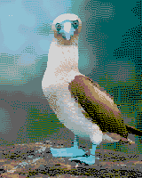
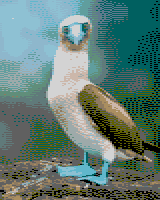

# DitherToMo


## Description
Dither image to the Thomson bitmap 40 (320x200 16 colors with color clash) graphic mode.

   

Or to the Thomson bitmap 16 (320x200 16 colors without constraint) graphic mode.

   


## Compilation
Rely on [ImageMagick 7](https://github.com/ImageMagick/ImageMagick) :

```shell
sudo apt install libjpeg-dev
sudo apt install libpng-dev
sudo apt install libgif-dev
git clone https://github.com/ImageMagick/ImageMagick.git
git checkout tags/7.1.1-13
./configure --with-quantum-depth=16 --disable-hdri
make
sudo make install
sudo ldconfig
git clone https://github.com/rodolphe74/DitherToMo.git
cmake .
make
```

## Binaries
Binaries|Utilisation
---|---
dtm40|MAP image creation in 320x200x16[^1]
dtm16|MAP image creation in 160x200x16[^1]
dtm1677|lz77 image creation in 160x200x16[^3]
mapc16|C header creation in 160x200x16[^2]
mapc1677|C header creation in 160x200x16 with lz77 compression[^2]
[^1]:[Les fichiers graphiques Thomson](http://collection.thomson.free.fr/code/articles/prehisto_bulletin/page.php?XI=0&XJ=13)
[^2]:[lz77](https://github.com/rodolphe74/lz77)
[^3]:see l77 image proprietary format description below


## 160x200*16 lz77 image format description
Not yet fully implemented, but should be:

Offset|Length|Description
---|---|---
0|3|Magic number [0x01 0x06 0x07]
3|1|x resolution / 4 (40 max)
4|1|x resolution (160 max)
5|1|y resolution (200 max)
6|32|palette 16 * 2 bytes (16 colors, each on 2 bytes)

